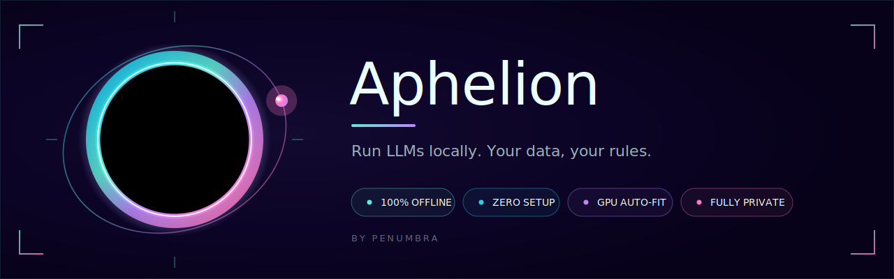

<p align="center">
  
</p>

<p align="center"><strong>Your own AI — running entirely on your computer. Free. Offline. No account, no cloud, nothing sent anywhere.</strong></p>

<p align="center">
  
  
  
</p>

---

**Aphelion** is an all-in-one desktop app that runs powerful AI models entirely on your own Windows PC — no servers, no cloud, no setup. Chat with characters, write stories, build branching dialogue, draft and analyze code, or ask an expert assistant. **Everything you type stays on your machine,** and once it's set up it works with the internet unplugged.

> *Aphelion (n.) — the point in an orbit farthest from the sun. Your AI, at the farthest point from the cloud.*

---

## ⬇️ Download & install (the easy way)

> **New here?** This page is on **GitHub** — a website where free software is shared. You don't need an account or to understand any of it. Just follow the four steps.

1. **[➡️ Click here to download the latest version](../../releases/latest)** — on that page, under **"Assets,"** click the file that ends in **`-setup.exe`**.
2. **Double-click the downloaded file** to install.
   - Windows may show a blue **"Windows protected your PC"** box. This is normal for new apps that haven't bought a "signing certificate" yet — it does **not** mean anything is wrong. Click **More info**, then **Run anyway.**
3. Aphelion opens and a **first-run setup** picks an AI model that fits your computer and downloads it (a one-time download, usually 2–16 GB depending on your hardware). Wait until it says **Ready.**
4. **That's it.** Start using it. From now on it runs **100% offline.**

---

## 💻 What you need

- **Windows 10 or 11** (64-bit).
- A **graphics card (GPU)** is strongly recommended — more video memory (VRAM) means a bigger, smarter AI. It runs on weaker hardware too; setup auto-fits a model that works.
- A few GB of free disk space for the model.
- Internet **only** for the first model download. After that, none.

---

## ✨ What it does

- **Stays on your machine.** Every prompt, model, and conversation runs and lives locally — your data never leaves your PC, online or off.
- **Zero setup, not a stack.** Install one app and start talking. No servers, no containers, no Ollama-plus-six-other-things to glue together.
- **Auto-fits your hardware.** Aphelion reads your GPU and VRAM and loads the best model that'll run fast — no config files, no guesswork.
- **A real workspace, not just a chat box.** Characters & roleplay, group chats, story writing, dialogue trees, and an expert assistant (a coding expert, a blunt straight-answers expert, and more) all live in one window.
- **Total privacy by default.** No account, no telemetry, no phone-home. The lock icon means what it says.
- **Open and yours.** Free, MIT-licensed, and built to be inspected, extended, and trusted.

There's a built-in **"How it works"** guide (bottom-left in the app) with a diagram of the pieces.

---

## ❓ Common questions

**Is it really free?** Yes. Completely. No account, no trial, no upsell.

**Does it send my conversations anywhere?** No — never. The AI runs on your own computer; disconnect from the internet and it keeps working.

**What's a "model"?** The AI's "brain" — a file the app downloads once. Setup picks a good one for your hardware; you can change it in Settings.

**Windows says it "protected my PC" — is that bad?** No. It just means the app isn't *code-signed* yet (a paid certificate). Click **More info → Run anyway.** The source is all right here to read.

**How do I uninstall it?** **Settings → Apps**, find *Aphelion*, click Uninstall. It will **ask whether to also delete the downloaded model and your chats** so you can reclaim the disk space, or keep them for later.

**Can I use an uncensored model?** Yes — setup has an opt-in section for them behind a clear warning. Whatever the AI writes is generated by the model, not by Aphelion (see below).

---

## ⚠️ A note on responsibility

Aphelion is an **interface**. Any text it produces is generated by the **AI model you choose**, not by this program or its authors. You are responsible for what you generate and how you use it. Uncensored models can produce content that is offensive, false, or otherwise objectionable — use them at your own discretion and risk.

---

## 🛠️ For developers (build from source)

*You can ignore this section unless you write code.*

**Prerequisites:** [Rust](https://rustup.rs/) (MSVC toolchain), [Node.js](https://nodejs.org/) 18+, and the **Visual Studio C++ Build Tools**.

```powershell
git clone https://github.com/penpro/Aphelion
cd Aphelion/frontend
npm install
npm run fetch-engine     # downloads the bundled llama.cpp engine into bin/llama (git-ignored)
npm run tauri build      # installer lands in src-tauri/target/release/bundle/nsis/
```

For a fast dev loop: `npm run tauri dev`.

- The llama.cpp engine binaries and model files are **git-ignored** (they're large) — `npm run fetch-engine` pulls a pinned engine build; models are downloaded by the app at runtime.
- If a build fails with *"file in use,"* close any running Aphelion window first — a running instance locks the engine DLLs the build needs.

**Stack:** [Tauri v2](https://tauri.app/) (Rust + React 18 / TypeScript / Vite), a bundled [llama.cpp](https://github.com/ggml-org/llama.cpp) server (Vulkan), and GGUF models. The engine runs hidden on `127.0.0.1` — no console window. Brand assets and design tokens live in [`Branding/penumbra-brand/`](Branding/penumbra-brand/).

---

## 📜 Credits & license

- **Aphelion** is a product of **Penumbra**.
- Inference by **[llama.cpp](https://github.com/ggml-org/llama.cpp)** (MIT).
- AI models (Gemma, etc.) are downloaded from their original publishers and remain under **their own licenses** — please respect them.

License: **[MIT](LICENSE)** — free to use, modify, and share. The whole point is to put local AI in everyone's hands.
